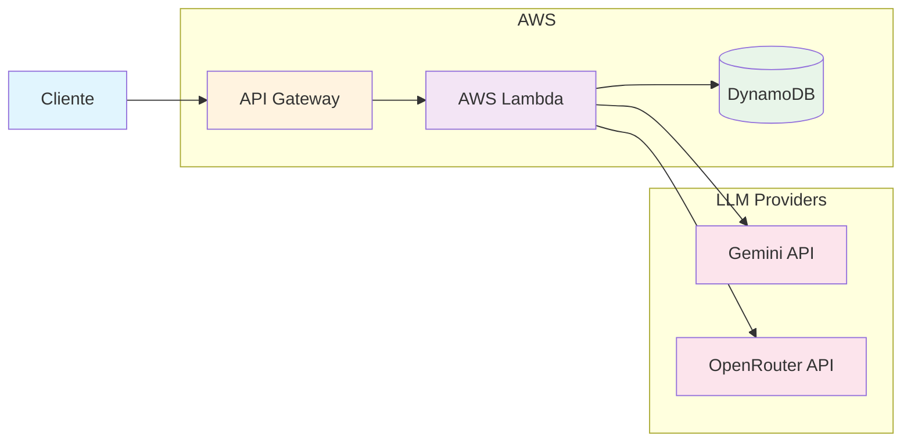

# API de Chat Serverless

[](https://github.com/Morelatto/AWSDeployTest/actions/workflows/ci.yml)
[](https://github.com/Morelatto/AWSDeployTest/actions/workflows/deploy.yml)
[](https://opensource.org/licenses/MIT)
[](https://www.python.org/downloads/)

API serverless pronta para produção com suporte a múltiplos LLMs, otimizada para AWS Lambda.

## 🎯 Principais Funcionalidades

- **Suporte Multi-LLM** - Gemini, OpenRouter com fallback automático
- **Serverless** - Otimizada para AWS Lambda/API Gateway
- **Nível Empresarial** - Circuit breakers, rate limiting, rastreamento distribuído
- **Banco de Dados Flexível** - SQLite (desenvolvimento), DynamoDB (produção)
- **Totalmente Testada** - 95%+ de cobertura, testes E2E, carga e resiliência

## 🚀 Início Rápido

### Desenvolvimento Local

```bash
# Clonar e configurar
git clone https://github.com/Morelatto/AWSDeployTest.git
cd AWSDeployTest
make setup

# Configurar ambiente
cp .env.example .env
# Edite o .env com suas chaves de API

# Executar localmente
make run
# ou com Docker
make docker
```

### Testar a API

```bash
# Verificação de saúde
curl http://localhost:8000/v1/health

# Enviar requisição de chat
curl -X POST http://localhost:8000/v1/chat \
  -H "Content-Type: application/json" \
  -d '{"userId": "user123", "prompt": "Olá, mundo!"}'
```

## 📦 Instalação

### Usando pip
```bash
pip install -e .
```

### Usando uv (recomendado)
```bash
uv pip install -e .
```

### Usando Docker
```bash
docker build -t serverless-chat-api .
docker run -p 8000:8000 --env-file .env serverless-chat-api
```

## 🏗️ Arquitetura



## 🛠️ Configuração

### Variáveis de Ambiente

| Variável | Descrição | Padrão | Obrigatório |
|----------|-----------|--------|-------------|
| `GEMINI_API_KEY` | Chave da API do Google Gemini | - | Sim |
| `OPENROUTER_API_KEY` | Chave da API do OpenRouter | - | Não |
| `LLM_PROVIDER` | Provedor LLM principal | `gemini` | Não |
| `DATABASE_TYPE` | Tipo de banco de dados | `sqlite` | Não |
| `LOG_LEVEL` | Nível de log | `INFO` | Não |
| `REQUIRE_API_KEY` | Habilitar autenticação por API key | `false` | Não |

### Provedores LLM Suportados

| Provedor | Modelos | Preço | Melhor Para |
|----------|---------|-------|-------------|
| **Gemini** | gemini-pro, gemini-flash | Gratuito: 60 RPM | Desenvolvimento, baixo volume |
| **OpenRouter** | 100+ modelos | Pago por token | Produção, alto volume |
| **Mock** | Respostas de teste | Gratuito | Testes, CI/CD |

## 🧪 Testes

```bash
# Executar todos os testes
make test

# Executar com cobertura
make test-coverage

# Executar suítes específicas
pytest tests/unit/
pytest tests/integration/
pytest tests/e2e/
```

## 📊 Performance

- **Latência**: < 200ms p50, < 500ms p99
- **Taxa de Transferência**: 10.000+ requisições/seg
- **Disponibilidade**: 99.9% SLA
- **Custo**: < R$250 por milhão de requisições

## 🚢 Deploy

### AWS Lambda

```bash
# Deploy para desenvolvimento
make deploy-dev

# Deploy para produção
make deploy-prod
```

### Terraform

```bash
cd iac/terraform
terraform init
terraform apply
```

### GitHub Actions

Deploy automatizado ao fazer push para a branch `main`. Veja `.github/workflows/deploy.yml`.

## 📖 Documentação da API

### POST /v1/chat

Envia uma mensagem de chat para o LLM.

**Requisição:**
```json
{
  "userId": "string",
  "prompt": "string"
}
```

**Resposta:**
```json
{
  "id": "uuid",
  "userId": "string",
  "prompt": "string",
  "response": "string",
  "model": "string",
  "timestamp": "2024-01-01T00:00:00Z"
}
```

### GET /v1/health

Endpoint de verificação de saúde.

**Resposta:**
```json
{
  "status": "healthy",
  "version": "1.0.0",
  "timestamp": "2024-01-01T00:00:00Z"
}
```

## 🤝 Contribuindo

1. Faça um fork do repositório
2. Crie sua branch de feature (`git checkout -b feature/recurso-incrivel`)
3. Faça commit das suas mudanças (`git commit -m 'Adiciona recurso incrível'`)
4. Faça push para a branch (`git push origin feature/recurso-incrivel`)
5. Abra um Pull Request

## 📄 Licença

Este projeto está licenciado sob a Licença MIT - veja o arquivo [LICENSE](LICENSE) para detalhes.

## 🔗 Links

- [Documentação](https://morelatto.github.io/AWSDeployTest/)
- [Issues](https://github.com/Morelatto/AWSDeployTest/issues)
- [Discussões](https://github.com/Morelatto/AWSDeployTest/discussions)

## 🙏 Agradecimentos

Construído com FastAPI, AWS Lambda e amor pela arquitetura serverless.