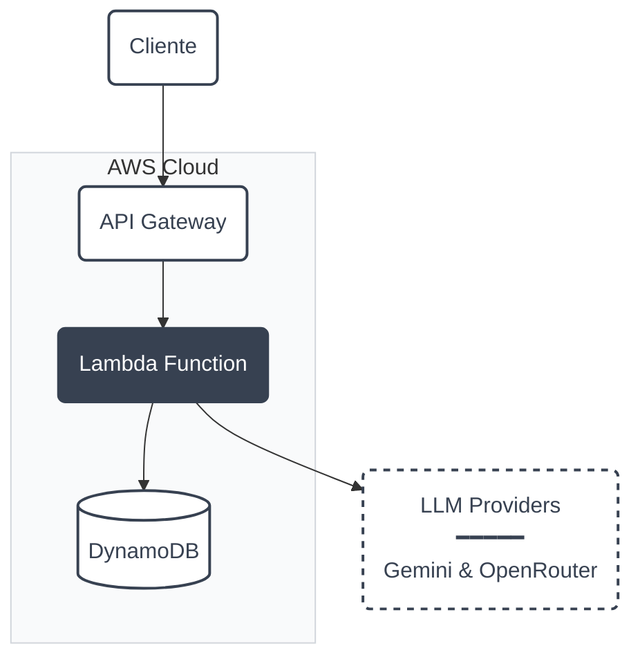

# API de Chat Serverless

[](https://github.com/Morelatto/AWSDeployTest/actions/workflows/ci.yml)
[](https://github.com/Morelatto/AWSDeployTest/actions/workflows/deploy.yml)
[](LICENSE)
[](https://www.python.org/downloads/)

API serverless multi-LLM em container Docker no AWS Lambda, com suporte a OpenRouter/Gemini, DynamoDB e deploy automático via GitHub Actions.

## Início Rápido

```bash
# Setup
git clone https://github.com/Morelatto/AWSDeployTest.git
cd AWSDeployTest && make dev
cp .env.example .env  # Configure suas API keys

# Executar
python -m src.main     # Local
make docker-env        # Docker

# Testar
curl localhost:8000/v1/health
curl -X POST localhost:8000/v1/chat \
  -H "Content-Type: application/json" \
  -d '{"userId": "user123", "prompt": "Olá!"}'
```

## Configuração

### LLM Providers (Uma das opções abaixo)
- `OPENROUTER_API_KEY` - Para usar OpenRouter (recomendado)
- `GEMINI_API_KEY` - Para usar Google Gemini diretamente
- `LLM_PROVIDER` - `openrouter` | `gemini` | `mock` (auto-detectado)

### Database
- **Local**: SQLite (`DATABASE_PATH` - default: `chat_history.db`)
- **Produção**: DynamoDB com `interaction_id` como chave primária
- `TABLE_NAME` ou `DYNAMODB_TABLE` - Nome da tabela DynamoDB

### Segurança
- `REQUIRE_API_KEY` - Habilitar autenticação (default: `false`)
- `API_KEY` ou `API_KEYS` - Chaves de API válidas
- `RATE_LIMIT_PER_MINUTE` - Default: 60

## API

**Documentação interativa disponível em `/docs` (Swagger) e `/redoc`**

### `POST /v1/chat`
```json
// Request
{"userId": "string", "prompt": "string"}

// Response
{
  "interaction_id": "uuid",
  "userId": "string",
  "prompt": "string",
  "response": "string",
  "model": "string",
  "timestamp": "ISO-8601"
}
```

### `GET /v1/health`
Retorna status, versão e timestamp.

## Deploy

### Arquitetura



### Componentes
- **Lambda com Container Images**: Supera limite de 250MB das layers tradicionais
- **ECR**: Armazenamento de imagens Docker (até 10GB)
- **DynamoDB**: Persistência serverless com Global Secondary Index
- **GitHub Actions**: CI/CD automático em push para `main`

### Deploy Manual
```bash
# Via Terraform
cd iac/terraform
terraform init
terraform apply

# Build e push Docker
aws ecr get-login-password | docker login --username AWS --password-stdin [ECR_URL]
docker build --build-arg TARGET=lambda -t serverless-chat-api .
docker tag serverless-chat-api:latest [ECR_URL]:latest
docker push [ECR_URL]:latest
```

### Deploy Automático
Push para `main` executa:
1. Testes e linting
2. Build da imagem Docker
3. Push para ECR
4. Deploy do Lambda via Terraform
5. Teste de saúde do endpoint

## Performance
- **Latência**: < 200ms p50, < 500ms p99 (cold start ~1-2s com container)
- **Concorrência**: 1000 execuções simultâneas
- **Memória**: 512MB configurável
- **Timeout**: 30s configurável
- **Custo estimado**: ~$0.20/milhão requisições + ECR storage

## Desenvolvimento

### Estrutura do Projeto
```
serverless-chat-api/
├── src/                    # Código fonte
│   ├── main.py            # FastAPI app com Mangum handler
│   ├── routes/            # Endpoints da API
│   └── shared/            # Config, database, LLM providers
├── iac/terraform/         # Infraestrutura como código
├── tests/                 # 98 testes com 91% cobertura
├── Dockerfile            # Multi-stage para local e Lambda
└── pyproject.toml        # Dependências e configuração
```

### Comandos
```bash
pytest tests/              # Executa todos os 98 testes
pytest tests/ --cov=src    # Com relatório de cobertura (91%)
ruff check src/           # Linting e formatação
make docker-env           # Desenvolvimento local com Docker
```

## 🤝 Contribuindo

1. Faça um fork do repositório
2. Crie sua branch de feature (`git checkout -b feature/recurso-incrivel`)
3. Faça commit das suas mudanças (`git commit -m 'Adiciona recurso incrível'`)
4. Faça push para a branch (`git push origin feature/recurso-incrivel`)
5. Abra um Pull Request

## 📄 Licença

Este projeto está licenciado sob a Licença MIT - veja o arquivo [LICENSE](LICENSE) para detalhes.
