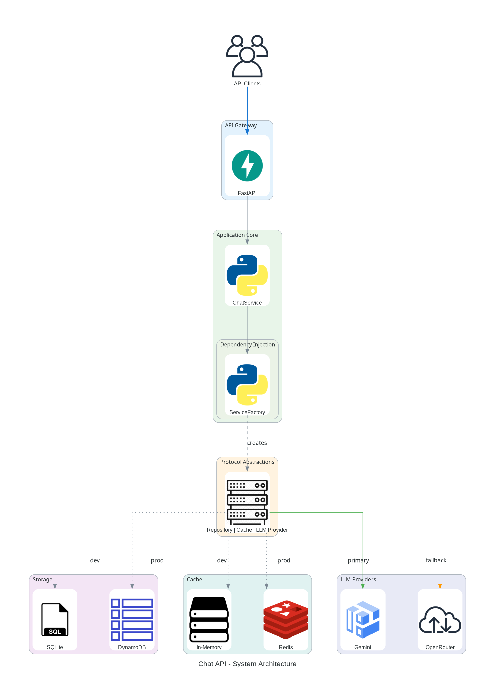
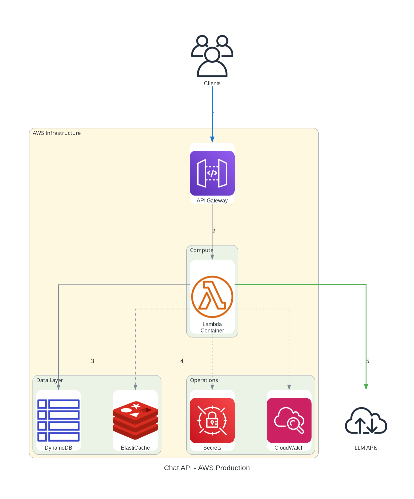
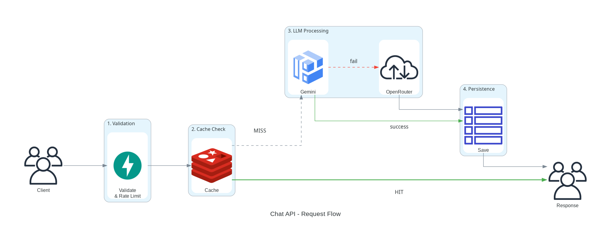
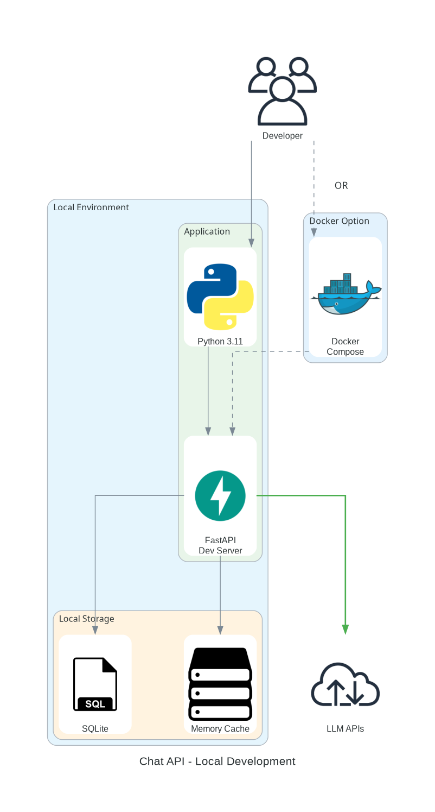

# Chat API Architecture

This document presents the essential architecture diagrams for the Chat API system.

## Overview

The Chat API is a **Pythonic, protocol-based** system that provides LLM chat capabilities with:
- Clean separation of concerns through protocol abstractions
- Environment-based dependency injection
- Primary/fallback LLM provider strategy
- Efficient caching layer
- Support for both local development and AWS production deployment

---

## 1. System Architecture



**Purpose**: Complete system overview showing all components and their relationships.

**Key Components**:
- **FastAPI**: REST API gateway with automatic OpenAPI documentation
- **ChatService**: Core business logic in Python
- **ServiceFactory**: Dependency injection container
- **Protocol Abstractions**: Clean interfaces for Repository, Cache, and LLM providers
- **Multiple Implementations**: SQLite/DynamoDB, In-Memory/Redis, Gemini/OpenRouter

**Design Principles**:
- Protocol-based abstractions for testability
- Environment-based implementation selection
- No hard dependencies between layers

---

## 2. AWS Production Deployment



**Purpose**: Production infrastructure on AWS.

**Infrastructure**:
- **API Gateway**: Rate limiting, authentication, routing
- **Lambda Function**: Container-based Python 3.11 runtime (1GB memory)
- **DynamoDB**: Serverless NoSQL database with on-demand scaling
- **ElastiCache Redis**: Distributed caching layer
- **CloudWatch**: Logging and monitoring
- **Secrets Manager**: Secure API key storage

**Deployment**:
- Container image via ECR
- Infrastructure as Code (Terraform)
- GitHub Actions CI/CD pipeline
- Estimated cost: $25-40/month for 10K requests/day

---

## 3. Request Processing Flow



**Purpose**: How requests are processed through the system.

**Flow Steps**:
1. **Validation & Rate Limiting**: Input validation and rate limit checks
2. **Cache Check**: Fast path for cached responses (green arrow)
3. **LLM Processing**: Primary provider (Gemini) with fallback to OpenRouter
4. **Persistence**: Save to database for history and analytics
5. **Response**: Return formatted response to client

**Optimizations**:
- Cache-first strategy reduces LLM API calls
- Fallback mechanism ensures reliability
- Async processing throughout

---

## 4. Local Development



**Purpose**: Development environment setup.

**Components**:
- **Python 3.11+**: With `uv` package manager
- **FastAPI Dev Server**: Auto-reload enabled
- **SQLite**: File-based database
- **In-Memory Cache**: Dictionary-based caching
- **Docker Compose**: Alternative containerized setup

**Development Workflow**:
```bash
# Install dependencies
uv sync --dev

# Run locally
uv run python -m chat_api

# Run tests
uv run pytest tests/ -v

# Docker alternative
docker-compose up
```

---

## 5. Dependency Injection


**Purpose**: How ServiceFactory configures dependencies based on environment.

**Process**:
1. **Environment Detection**: Check for AWS Lambda, Docker, or local
2. **Implementation Selection**: Choose appropriate implementations
3. **Dependency Creation**: Create instances with proper configuration
4. **Service Injection**: Inject dependencies into ChatService

**Benefits**:
- Zero configuration changes between environments
- Easy testing with mock implementations
- Clean separation of concerns

---

## Key Technologies

| Component | Technology | Icon | Purpose |
|-----------|------------|------|---------|
| API Framework | FastAPI | 🚀 | High-performance async REST API |
| Language | Python 3.11+ | 🐍 | Modern Python with type hints |
| Local DB | SQLite | 🗄️ | File-based development database |
| Production DB | DynamoDB | 🔥 | Serverless NoSQL database |
| Local Cache | In-Memory | 💾 | Dictionary-based caching |
| Production Cache | Redis | ⚡ | Distributed caching |
| Primary LLM | Google Gemini | 🤖 | Fast, cost-effective LLM |
| Fallback LLM | OpenRouter | 🌐 | Multi-model LLM gateway |
| Container | Docker | 🐳 | Consistent deployment |
| Cloud | AWS Lambda | ☁️ | Serverless compute |

---

## Quick Start

### Local Development
```bash
# Clone and setup
git clone <repository>
cd chat-api
make dev

# Configure
cp .env.example .env
# Add your API keys to .env

# Run
make run
```

### View Diagrams
All architecture diagrams are in `docs/asset/`:
- 5 essential high-resolution PNGs
- Source: `docs/diagrams/generate_final_diagrams.py`
- Regenerate with `make diagrams`

---

## Architecture Decisions

1. **Protocol-Based Design**: Enables easy testing and swapping of implementations
2. **Async Throughout**: Maximizes performance with FastAPI's async capabilities
3. **Environment Detection**: Automatic configuration based on runtime environment
4. **Fallback Strategy**: Ensures reliability with multiple LLM providers
5. **Cache-First**: Reduces costs and improves response times

---

## More Information

- [API Documentation](/docs) - Interactive Swagger UI
- [ADRs](adr/) - Architecture Decision Records
- [Deployment Guide](DEPLOYMENT.md) - Production deployment instructions
- [Testing Strategy](TESTING.md) - Test coverage and strategies
