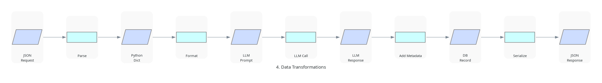
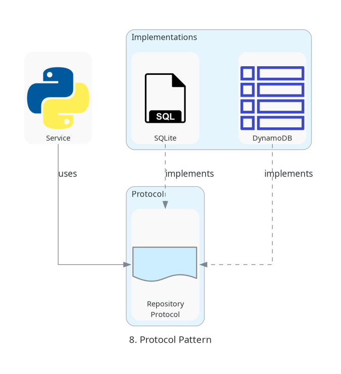

# Chat API Architecture

Simple, focused architecture diagrams. Each diagram answers ONE specific question.

## Core Diagrams

### 1. Static Structure
**Question: What are the main components?**


Simple component overview showing:
- Client → API → Service
- Service uses Database, Cache, and LLM API
- No protocols or abstractions shown (kept simple)

---

### 2. Request Flow
**Question: How does a request flow through the system?**


Linear request path:
1. POST /chat request
2. Validation
3. Cache check (miss shown)
4. LLM API call
5. Save to database
6. Return response

---

### 3. Deployment Environments
**Question: Where does the system run?**


Three deployment options:
- **Local**: Python + SQLite
- **Docker**: Container + SQLite
- **AWS**: Lambda + DynamoDB

---

### 4. Data Transformations
**Question: How is data transformed?**



Data format at each stage:
- JSON Request → Python Dict → LLM Prompt
- LLM Response → DB Record → JSON Response

---

### 5. Error Handling
**Question: What happens when things fail?**


Common failure points:
- Validation errors
- Rate limit exceeded
- LLM API timeout
- Database errors

All lead to structured error response.

---

### 6. Runtime Dependencies
**Question: What depends on what?**


Dependency direction (bottom-up):
- Config is needed by everything
- Resources (DB, Cache, LLM) are needed by Service
- Service is needed by API

---

### 7. AWS Infrastructure
**Question: What AWS services are used?**


Production AWS services:
- API Gateway → Lambda
- Lambda uses: DynamoDB, ElastiCache, Secrets Manager

---

### 8. Protocol Pattern
**Question: How do protocols enable flexibility?**



Protocol abstraction example:
- Service uses Repository Protocol
- SQLite and DynamoDB both implement the protocol
- Allows switching implementations without changing service code

---

## Sequence Diagrams

### 9. Happy Path
**Question: What's the normal successful flow?**


Time-ordered successful request:
- Client → API → Handler → Service
- Cache miss → LLM call → Save → Response

---

### 10. Cache Hit
**Question: How does caching speed up responses?**


Fast path when response is cached:
- No LLM API call needed
- Direct response from cache

---

### 11. Error Recovery
**Question: How does fallback work?**


Primary provider fails, fallback succeeds:
- Gemini timeout/error
- Automatic fallback to OpenRouter
- Transparent to client

---

### 12. Application Startup
**Question: How does the app initialize?**


Startup sequence:
- Load configuration
- Factory creates implementations
- Initialize app with dependencies
- Start server

---

## Key Design Principles

1. **Simple Components**: Each component has one responsibility
2. **Protocol Abstraction**: Implementations can be swapped
3. **Cache-First**: Check cache before expensive operations
4. **Graceful Fallback**: Primary → Fallback for reliability
5. **Environment-Based Config**: Automatic adaptation to runtime

## Technology Choices

| Component | Technology | Why |
|-----------|------------|-----|
| API | FastAPI | Async, fast, automatic docs |
| Language | Python 3.11+ | Modern, async support |
| Local DB | SQLite | Zero setup, file-based |
| Prod DB | DynamoDB | Serverless, scales automatically |
| Cache | Memory/Redis | Fast response for repeated queries |
| Primary LLM | Gemini | Cost-effective, fast |
| Fallback LLM | OpenRouter | Multi-model gateway |

## Quick Reference

### File Locations
- **Diagrams**: `docs/asset/*.png`
- **Source Code**: `chat_api/`
- **Tests**: `tests/`
- **Config**: `.env` (from `.env.example`)

### Key Commands
```bash
# Local development
uv run python -m chat_api

# Run tests
uv run pytest tests/

# Generate diagrams
make diagrams

# Docker
docker-compose up
```

### Environment Variables
- `CHAT_LLM_PROVIDER`: gemini or openrouter
- `CHAT_DATABASE_URL`: SQLite or DynamoDB
- `CHAT_REDIS_URL`: Optional Redis cache
- `CHAT_RATE_LIMIT`: Requests per minute

---

*These diagrams prioritize clarity over completeness. Each answers one specific question without unnecessary detail.*
