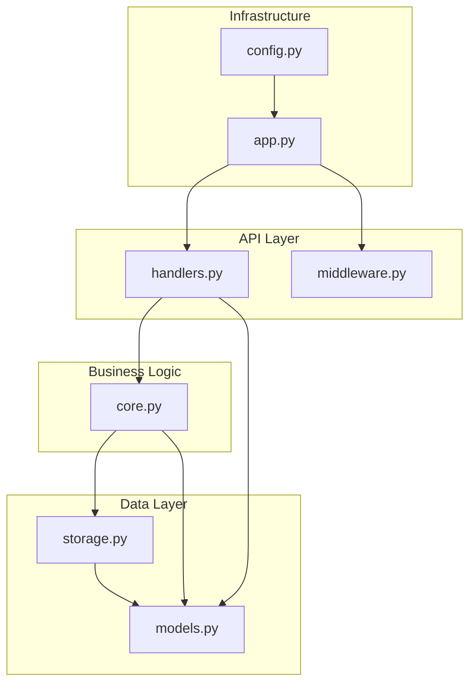

# ADR-001: Architecture and Design Patterns

## Status
Accepted

## Context
Chat API service requiring simple, maintainable architecture with clear separation of concerns, high testability, and production readiness.

## Decision
Pythonic flat architecture with module-level functions, minimal abstractions, and convention over configuration.

## Architecture



## Design Patterns

### Module Organization
Flat structure with single-purpose modules:
- `app.py` - FastAPI application lifecycle
- `handlers.py` - HTTP request handlers
- `core.py` - Business logic functions
- `storage.py` - Database and cache operations
- `models.py` - Pydantic models with validation
- `config.py` - Settings management
- `middleware.py` - Cross-cutting concerns

### Function Signatures
```
# Direct module-level functions
async def process_message(user_id: str, content: str) -> ChatResponse
async def get_user_history(user_id: str, limit: int) -> List[ChatMessage]
async def save_interaction(interaction: ChatInteraction) -> None
```

### Dependency Management
- Module-level singletons: `settings = get_settings()`
- Lazy initialization in app lifecycle
- No complex dependency injection frameworks

### Entry Points
- `__main__.py` enables `python -m chat_api`
- `__init__.py` exports public API
- Clean import paths: `from chat_api import process_message`

## Consequences

### Positive
- Simple, readable codebase
- Fast development velocity
- Low cognitive overhead
- Easy debugging and testing
- Standard Python patterns

### Negative
- Less flexibility for swapping implementations
- Tighter coupling between modules
- Limited to single deployment unit

## Metrics
- Lines of code: ~1,500 (70% reduction from Java-style)
- Import depth: 1 level
- Cyclomatic complexity: <5 per function
- Test coverage: >75%
