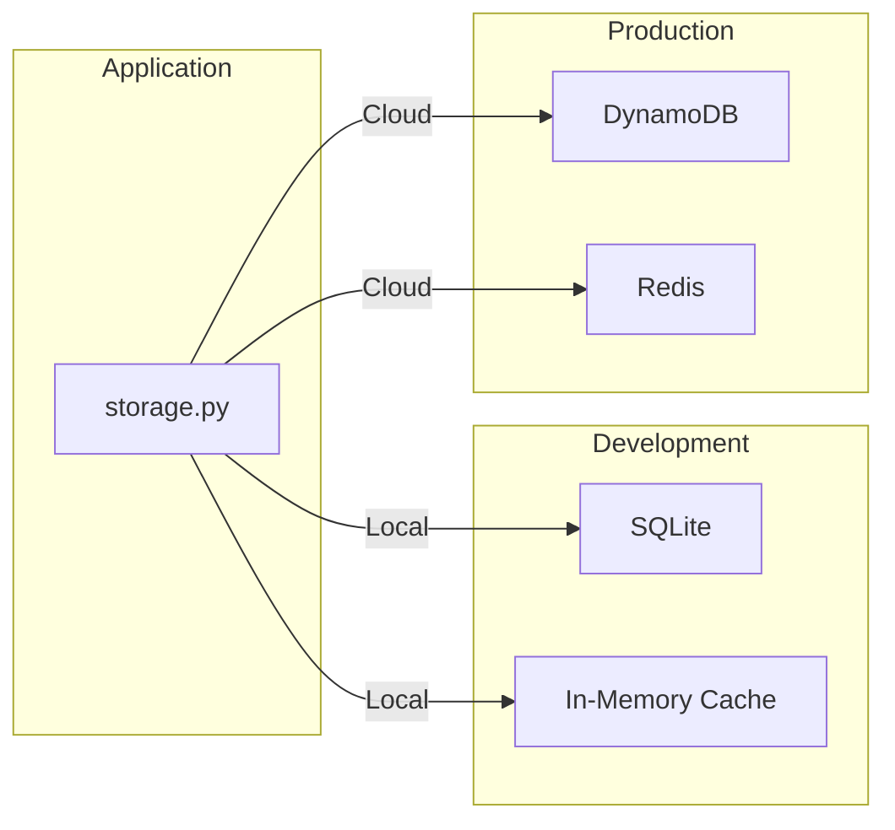
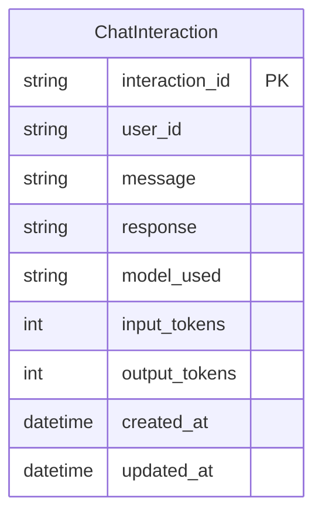
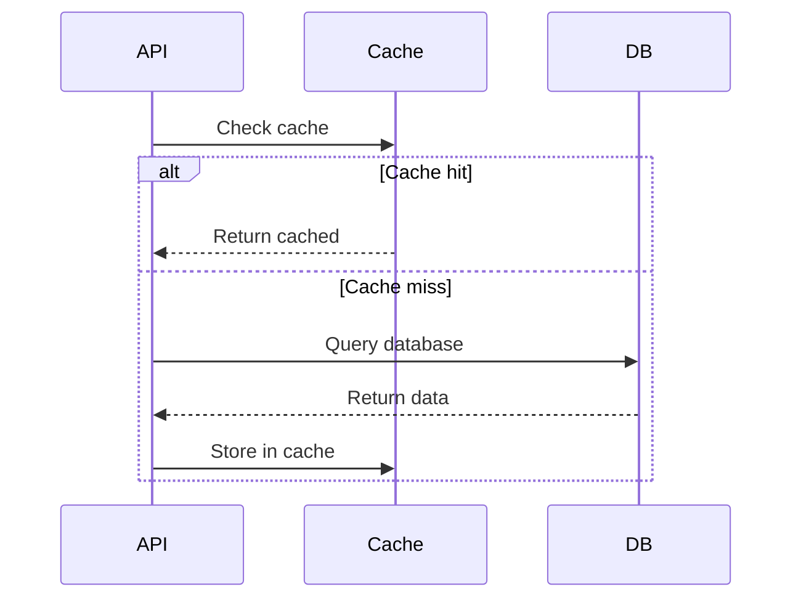

# ADR-002: Data Management and Storage

## Status
Accepted

## Context
System requires persistent storage for chat interactions, caching for performance, and support for both local development and cloud deployment.

## Decision
Dual storage strategy with SQLite for development, cloud-native solutions for production, and optional Redis caching.

## Storage Architecture



## Data Model



## Storage Operations

### Interface Signatures
```
async def save_interaction(interaction: ChatInteraction) -> None
async def get_interaction(interaction_id: str) -> Optional[ChatInteraction]
async def get_user_interactions(user_id: str, limit: int) -> List[ChatInteraction]
async def cache_get(key: str) -> Optional[str]
async def cache_set(key: str, value: str, ttl: int) -> None
```

### Storage Selection
```python
if settings.environment == "production":
    storage = CloudStorage(dynamodb, redis)
else:
    storage = LocalStorage(sqlite, memory_cache)
```

## Caching Strategy

### Cache Patterns
- **Read-through**: Check cache before database
- **Write-through**: Update cache on writes
- **TTL-based expiration**: 5 minutes default
- **Key format**: `chat:{user_id}:{hash(content)}`

### Cache Invalidation


## Database Configuration

### SQLite (Development)
- WAL mode for concurrency
- Connection pooling (size: 5)
- Automatic migrations
- File-based persistence

### DynamoDB (Production)
- On-demand billing
- Global secondary index on user_id
- Point-in-time recovery
- TTL for data retention

### Redis (Production)
- Connection pooling
- Automatic reconnection
- Cluster mode compatible
- Memory limits enforced

## Data Lifecycle

### Retention Policy
- Active data: 30 days in hot storage
- Archive: 90 days in cold storage
- Deletion: After 90 days (GDPR compliance)
- Cache: 5 minute TTL

### Backup Strategy
- SQLite: File system snapshots
- DynamoDB: Continuous backups
- Redis: Persistence disabled (cache only)

## Performance Characteristics

| Operation | SQLite | DynamoDB | Cache |
|-----------|--------|----------|-------|
| Write | 5ms | 10ms | 1ms |
| Read by ID | 2ms | 5ms | 0.5ms |
| Query by user | 10ms | 15ms | N/A |
| Batch write | 50ms | 20ms | 5ms |

## Consequences

### Positive
- Zero-config local development
- Cloud-native production scaling
- Cost-effective with on-demand pricing
- Cache improves response times by 80%

### Negative
- Different behaviors between environments
- Cache complexity for consistency
- Storage adapter abstraction needed
