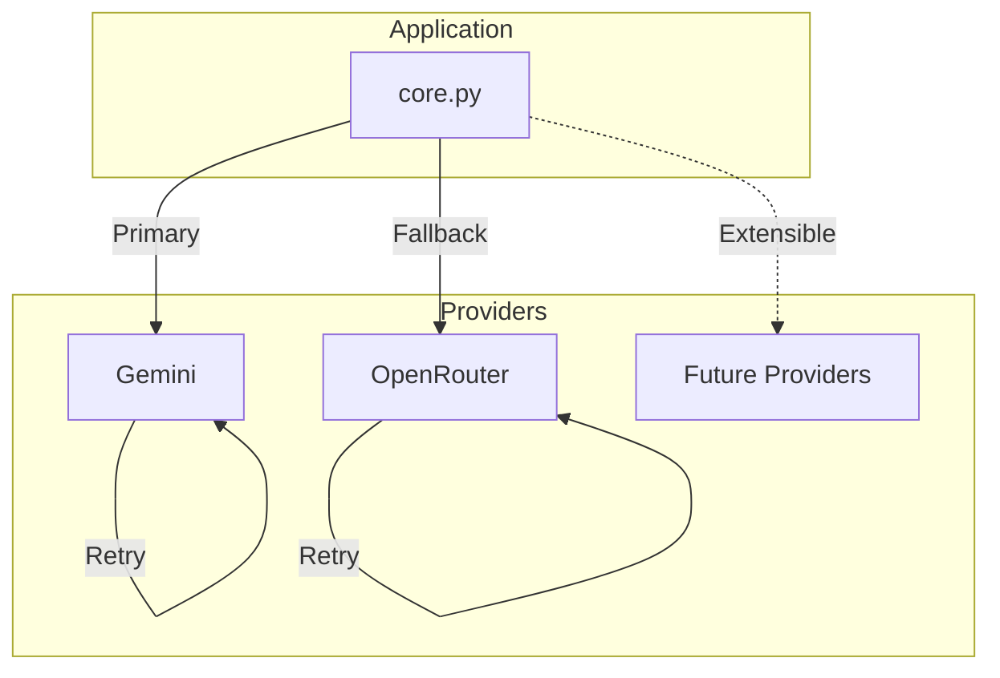
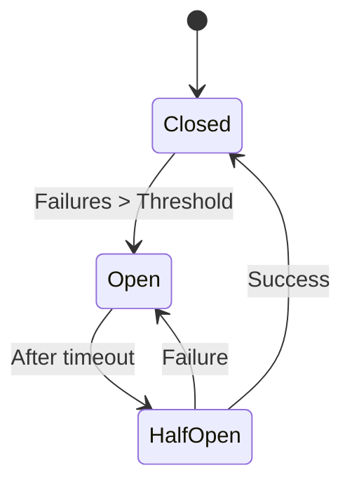
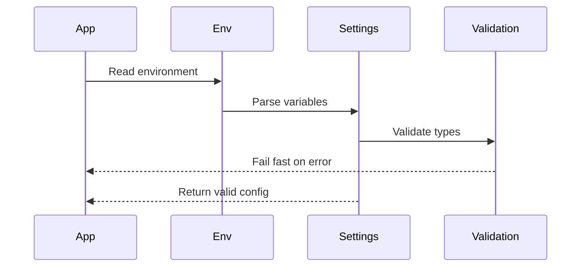
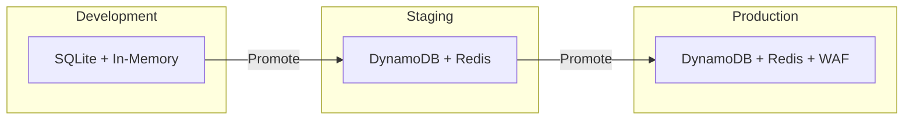

# ADR-004: External Integrations and Configuration

## Status
Accepted

## Context
System requires integration with multiple LLM providers, secure configuration management, and resilient external service handling.

## Decision
Provider-agnostic LLM integration with fallback support, environment-based configuration with validation, and comprehensive resilience patterns.

## LLM Integration Architecture



## Provider Interface

### LLM Operations
```python
async def call_llm(
    prompt: str,
    model: Optional[str] = None,
    temperature: float = 0.7,
    max_tokens: int = 1000
) -> LLMResponse

@dataclass
class LLMResponse:
    content: str
    model: str
    input_tokens: int
    output_tokens: int
    latency_ms: int
```

### Provider Selection
```python
provider = settings.llm_provider  # "gemini" | "openrouter"
if primary_fails:
    provider = fallback_provider
```

## Resilience Patterns

### Retry Strategy
```python
@retry(
    stop=stop_after_attempt(3),
    wait=wait_exponential(multiplier=1, min=2, max=10),
    retry=retry_if_exception_type((ConnectionError, TimeoutError))
)
async def call_with_retry():
    # Exponential backoff: 2s, 4s, 8s
```

### Circuit Breaker


### Fallback Chain
1. Primary provider (Gemini)
2. Secondary provider (OpenRouter)
3. Cached response (if available)
4. Graceful degradation message

## Configuration Management

### Environment Variables
```bash
# CHAT_ prefix for all variables
CHAT_ENVIRONMENT=production
CHAT_LLM_PROVIDER=gemini
CHAT_GEMINI_API_KEY=xxx
CHAT_OPENROUTER_API_KEY=yyy
CHAT_DATABASE_URL=sqlite:///chat.db
CHAT_REDIS_URL=redis://localhost
CHAT_RATE_LIMIT=60/minute
```

### Settings Validation
```python
class Settings(BaseSettings):
    # Required fields
    llm_provider: Literal["gemini", "openrouter"]

    # Optional with defaults
    rate_limit: str = "60/minute"
    cache_ttl: int = 300

    # Secrets (masked in logs)
    gemini_api_key: Optional[SecretStr]
    openrouter_api_key: Optional[SecretStr]

    @validator("gemini_api_key")
    def validate_api_keys(cls, v, values):
        # Provider-specific validation
```

### Configuration Lifecycle


## Rate Limiting

### Implementation
```python
limiter = Limiter(
    key_func=get_user_id,
    default_limits=[settings.rate_limit]
)

@limiter.limit("5/minute")  # Override for specific endpoint
async def expensive_operation():
    pass
```

### Rate Limit Headers
```http
X-RateLimit-Limit: 60
X-RateLimit-Remaining: 45
X-RateLimit-Reset: 1234567890
```

## Security Considerations

### API Key Management
- Never logged or exposed in errors
- SecretStr type for automatic masking
- Validated at startup
- Rotatable without code changes

### Request Validation
```python
class ChatRequest(BaseModel):
    message: str = Field(..., min_length=1, max_length=4000)
    user_id: str = Field(..., regex="^[a-zA-Z0-9_-]+$")

    @validator("message")
    def sanitize_message(cls, v):
        # Remove PII, sanitize input
        return sanitize(v)
```

## External Service Timeouts

| Service | Connect | Read | Total |
|---------|---------|------|-------|
| Gemini | 5s | 25s | 30s |
| OpenRouter | 5s | 25s | 30s |
| Redis | 1s | 2s | 3s |
| DynamoDB | 2s | 5s | 7s |

## Deployment Configuration

### Environment-Specific Settings


### Feature Flags
```python
settings.features = {
    "cache_enabled": env != "development",
    "rate_limiting": env == "production",
    "detailed_health": env != "production",
    "pii_detection": True
}
```

## Library Dependencies

### Core Dependencies
- **FastAPI**: Web framework
- **Pydantic**: Data validation
- **httpx**: Async HTTP client
- **tenacity**: Retry logic
- **slowapi**: Rate limiting

### Provider SDKs
- **google-generativeai**: Gemini integration
- **openai**: OpenRouter compatibility
- **redis**: Cache client
- **boto3**: AWS services

## Consequences

### Positive
- Provider flexibility without code changes
- Fail-fast configuration validation
- Resilient external service handling
- Secure credential management

### Negative
- Configuration complexity
- Multiple provider SDKs
- Fallback logic overhead
